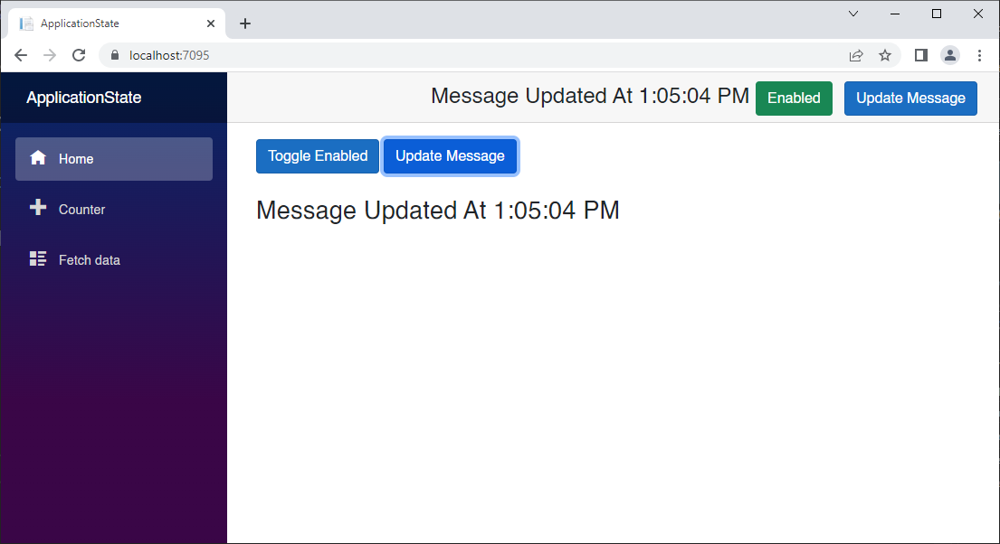
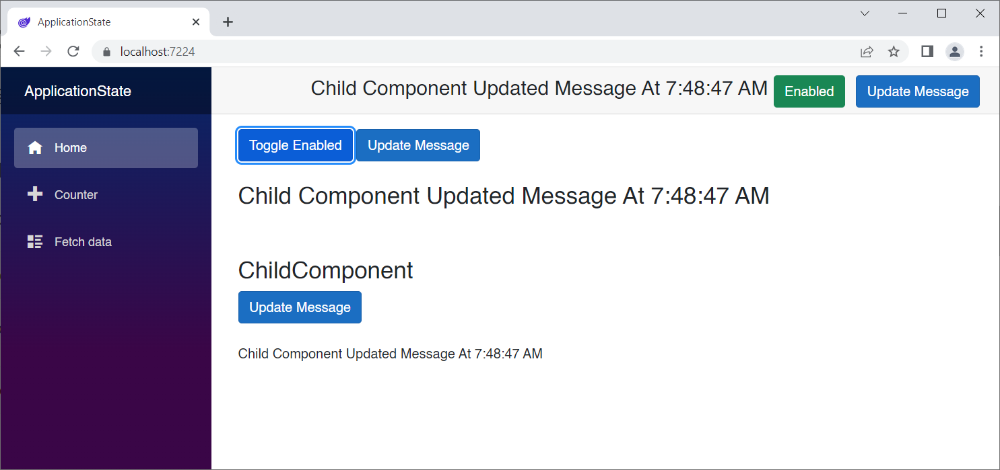
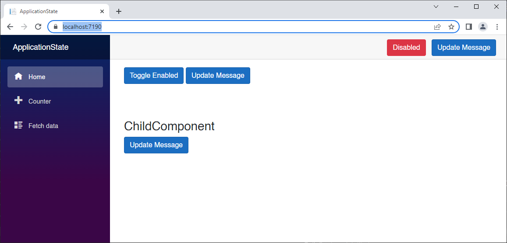
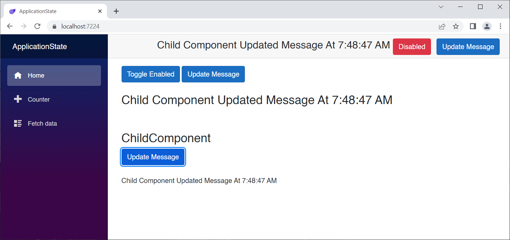

# Handling Application State in Blazor

### What is Application State?

Application State (or app state) is all of the variables (objects, lists, etc.) that you keep alive in your application while in use.  So far we have been keeping all of our variables in code blocks inside of pages. The problem with this approach is that those variables get reinitialized every time the page is navigated to or refreshed. 

The key to app state is to move it to a component that lives *outside* of the pages so that 

1. variables persist between navigations and page refreshes
2. variables can be shared by all pages and components

#### Goals of AppState Component

1. We want UI to automatically update via binding whenever any of the properties update.
2. We want to get control when the state gets mutated.
3. We want to know who (which component) changed the state.

### Create a Hosted WASM project called ApplicationState

The approach we will take is to use a Cascading Value. This is essentially an object reference that can be accessed by any component in the render tree below where it is defined. If we want all pages and components to have access to it, we can wrap it around the Router in *App.razor*, but I'm getting ahead of myself.

**Observe the default behavior**

Run the app (F5)

Go to the `Counter` page and increment the counter, now navigate to the `Home` page (*Index*) and back to `Counter`. Notice that the counter has been reset to zero!

This is because the counter value itself (currentCount) is defined within the page.

```c#
@page "/counter"

<PageTitle>Counter</PageTitle>

<h1>Counter</h1>

<p role="status">Current count: @currentCount</p>

<button class="btn btn-primary" @onclick="IncrementCount">Click me</button>

@code {
    private int currentCount = 0;

    private void IncrementCount()
    {
        currentCount++;
    }
}
```

Remember from the section on the component lifecycle, whenever you navigate to a page, it is reinitialized. All of the module-level variables (such as currentCount) get reset to default values.

Let's fix that on our way to provide state to the entire app.

#### Add a new Razor Component to the Shared folder called CascadingAppState.razor

```c#
<CascadingValue Value="this">
    @ChildContent
</CascadingValue>

@code {

    [Parameter]
    public RenderFragment ChildContent { get; set; }

    private string Caller = "";

    public void SetProperty(ComponentBase caller, string PropertyName, 
                            object PropertyValue)
    {
        try
        {
            var prop = this.GetType().GetProperty(PropertyName);
            if (prop != null)
            {
                this.Caller = caller.GetType().Name;
                prop.SetValue(this, PropertyValue);
                StateHasChanged();
            }
        }
        catch(Exception ex)
        {

        }
    }

    private string message = "";
    public string Message
    {
        get => message;
        private set
        {
            message = value;
            if (Caller == "Toolbar")
            {
                // The Toolbar component changed the AppState Message property
            }
        }
    }

    private bool enabled = false;
    public bool Enabled
    {
        get => enabled;
        private set
        {
            enabled = value;
        }
    }

    private int counter = 0;
    public int Counter
    {
        get => counter;
        private set
        {
            counter = value;
            if (Caller == "Counter")
            {
                // The Counter page changed the AppState Counter property
            }
        }
    }
}
```

#### Why Private Settters?

In order to determine which mutated the state, we've created private setters for each property. 

Properties are set by calling the `SetProperty()` method.

#### What is a RenderFragment?

From the docs at https://learn.microsoft.com/en-us/dotnet/architecture/blazor-for-web-forms-developers/components:

> A `RenderFragment` represents a chunk of Razor markup that can then be rendered by the component.  Razor components can capture their child content as a `RenderFragment` and render that content as part of the component rendering. To capture child content, define a component parameter of type `RenderFragment` and name it `ChildContent`.

Using a RenderFragment named ChildContent tells the Blazor component engine that ChildContent is everything in the render tree below this component.

The three property handlers must be explicit so that we can call `StateHasChanged()` when values are set. That tells the rendering engine that something has changed, and a redraw is necessary.

#### Wrap the entire contents of App.razor in an instance of CascadingAppState

```xml
<CascadingAppState>
    <Router AppAssembly="@typeof(App).Assembly">
        <Found Context="routeData">
            <RouteView RouteData="@routeData" DefaultLayout="@typeof(MainLayout)" />
            <FocusOnNavigate RouteData="@routeData" Selector="h1" />
        </Found>
        <NotFound>
            <PageTitle>Not found</PageTitle>
            <LayoutView Layout="@typeof(MainLayout)">
                <p role="alert">Sorry, there's nothing at this address.</p>
            </LayoutView>
        </NotFound>
    </Router>
</CascadingAppState>
```

#### Add a Razor Component to the Shared folder called Toolbar.razor

```c#
<div style="height:42px;">
    <span style="font-size:x-large">@AppState.Message&nbsp;</span>
    @if (AppState.Enabled)
    {
            <button class="btn btn-success">Enabled</button>
    }
    else
    {
            <button class="btn btn-danger">Disabled</button>
    }
    &nbsp;
    <button class="btn btn-primary" @onclick="UpdateMessageButtonClicked">Update Message</button>
</div>

@code {

    [CascadingParameter]
    public CascadingAppState AppState { get; set; }

    void UpdateMessageButtonClicked()
    {
        AppState.SetProperty(this, "Message", "Message Updated At " + DateTime.Now.ToLongTimeString());
    }
}
```

The Toolbar will go across the top of the page. 

Note that we grab the reference to `CascadingAppState` with the `[CascadingParameter]` attribute. It's almost the same as injection, except that it's optimized for use in Blazor components and pages.

Now we can refer to `AppState` and it's properties anywhere in the component. The values of those properties exist OUTSIDE the page, and will still be there if we reload the component.

#### Modify Shared\MainLayout.razor to show the Toolbar

```xml
@inherits LayoutComponentBase

<div class="page">
    <div class="sidebar">
        <NavMenu />
    </div>

    <main>
        <div class="top-row px-4">
            <Toolbar />
        </div>

        <article class="content px-4">
            @Body
        </article>
    </main>
</div>
```

#### Modify Pages\Index.razor

```c#
@page "/"

<button class="btn btn-primary" @onclick="ToggleEnabledButtonClicked">Toggle Enabled</button>

<button class="btn btn-primary" @onclick="UpdateMessageButtonClicked">Update Message</button>
<br />
<br />
<h3>@AppState.Message</h3>
<br />
<br />

@code {

    [CascadingParameter] public CascadingAppState AppState { get; set; }

    void ToggleEnabledButtonClicked()
    {
        AppState.SetProperty(this, "Enabled", !AppState.Enabled);
    }

    void UpdateMessageButtonClicked()
    {
        AppState.SetProperty(this, "Message", "Message Updated At " 
                             + DateTime.Now.ToLongTimeString());
    }
}
```

Again, we're grabbing that cascading reference to CascadingAppState. Now we have two components with access to it, and they can both get and set it's properties. 

Note that we are calling `AppState.SetProperty()` passing ourself (`this`), the property name, and the new value.

#### Modify Pages\Counter.razor

```c#
@page "/counter"

<h1>Counter</h1>

<p>Current count: @AppState.Counter</p>

<button class="btn btn-primary" @onclick="IncrementCount">Click me</button>

@code {

    [CascadingParameter] public CascadingAppState AppState { get; set; }

    private void IncrementCount()
    {
        AppState.SetProperty(this, "Counter", AppState.Counter + 1);
    }
}
```

Here we have replaced currentCount with `AppState.Counter`. 

Put breakpoints on lines 21 and 47

Go to the `Counter` page, and click the button. Now when it breaks on line 47, you can take action in the toolbar because you know some other component modified the `Counter` property of the `CascadingAppState` reference. 

Notice that our `counter` page remembers the value between navigations. That's because it is being stored in the `CascadingAppStateProvider`!

Click the **Update Message** button in the Toolbar to test the breakpoint on line 21.



#### Add a Razor Component called ChildComponent to Shared folder

```c#
<h3>ChildComponent</h3>

<button class="btn btn-primary" @onclick="UpdateMessageButtonClicked">Update Message</button>
<br />
<br />
<p>@AppState.Message</p>

@code {

    [CascadingParameter] public CascadingAppState AppState { get; set; }

    void UpdateMessageButtonClicked()
    {
        AppState.SetProperty(this, "Message", "Child Component Updated Message At " 
            + DateTime.Now.ToLongTimeString());
    }
}
```

#### Add ChildComponent to Index.razor

*Index.razor*:

```c#
@page "/"

<button class="btn btn-primary" @onclick="ToggleEnabledButtonClicked">Toggle Enabled</button>

<button class="btn btn-primary" @onclick="UpdateMessageButtonClicked">Update Message</button>
<br />
<br />
<h3>@AppState.Message</h3>
<br />
<br />
<ChildComponent />

@code {

    [CascadingParameter] public CascadingAppState AppState { get; set; }

    void ToggleEnabledButtonClicked()
    {
        AppState.SetProperty(this, "Enabled", !AppState.Enabled);
    }

    void UpdateMessageButtonClicked()
    {
        AppState.SetProperty(this, "Message", "Message Updated At " 
                             + DateTime.Now.ToLongTimeString());
    }
}
```

Run the app to confirm that the child component can change AppState values.



## Persisting Application State

It would be great if we could save certain `AppState` properties so that they will come back the next time the app is run. 

We will need access to LocalStorage. For this we will use Chris Sainty's `Blazored.LocalStorage` pagckage.

Add the following package reference to *ApplicationState.Client.csproj*:

```xml
<PackageReference Include="Blazored.LocalStorage" Version="4.2.0" />
```

Add this to *Program.cs*

```c#
builder.Services.AddBlazoredLocalStorage();
```

You'll need this:

```c#
using Blazored.LocalStorage;
```

Add to *_Imports.razor*:

```c#
@using Blazored.LocalStorage
@using System.Text.Json
```

We are going to separate the properties we want to persist into an interface.

That will allow us to serialize just those properties to JSON.

Add the following class to the client project:

*IAppState.cs*

```c#
public interface IAppState
{
    int TimeToLiveInSeconds { get; set; }
    DateTime LastAccessed { get; set; }
    string Message { get; }
    bool Enabled { get; }
    int Counter { get; }
}
```

`System.Text.Json` will not deserialize to an interface, so we have to create a class that implements the interface:

```c#
public class AppStateData : IAppState
{
    public int TimeToLiveInSeconds { get; set; }
    public DateTime LastAccessed { get; set; }
    public string Message { get; set; } = "";
    public bool Enabled { get; set; }
    public int Counter { get; set; }
}
```

Replace *CascadingAppState.razor* with the following:

```c#
@implements IAppState
@inject ILocalStorageService LocalStorageService

<CascadingValue Value="this">
    @ChildContent
</CascadingValue>

@code {

    [Parameter]
    public RenderFragment ChildContent { get; set; }

    private string Caller = "";

    public int TimeToLiveInSeconds { get; set; } = 60;
    public DateTime LastAccessed { get; set; } = DateTime.Now;

    public void SetProperty(ComponentBase caller, string PropertyName, 
                            object PropertyValue)
    {
        try
        {
            var prop = this.GetType().GetProperty(PropertyName);
            if (prop != null)
            {
                this.Caller = caller.GetType().Name;
                prop.SetValue(this, PropertyValue);
                SaveChanges();
                StateHasChanged();
            }
        }
        catch(Exception ex)
        {

        }
    }

    private string message = "";
    public string Message
    {
        get => message;
        private set
        {
            message = value;
            if (Caller == "Toolbar")
            {
                // The Toolbar component changed the AppState Message property
            }
        }
    }

    private bool enabled = false;
    public bool Enabled
    {
        get => enabled;
        private set
        {
            enabled = value;
        }
    }

    private int counter = 0;
    public int Counter
    {
        get => counter;
        private set
        {
            counter = value;
            if (Caller == "Counter")
            {
                // The Counter page changed the AppState Counter property
            }
        }
    }

    protected override async Task OnAfterRenderAsync(bool firstRender)
    {
        if (firstRender) // do this only once
        {
            // Get the JSON data
            var json = await LocalStorageService.GetItemAsStringAsync("AppStateJson");
            if (json != null && json != "")
            {
                // Deserialize to AppStateData
                var appStateData = JsonSerializer.Deserialize<AppStateData>(json);
                // Are we within the time window?
                if (DateTime.Now <= appStateData.LastAccessed
                    .AddSeconds(appStateData.TimeToLiveInSeconds))
                {
                    // Yes! use reflection to set our property values
                    var properties = appStateData.GetType().GetProperties();
                    foreach (var property in properties)
                    {
                        var type = property.PropertyType;
                        var value = property.GetValue(appStateData);
                        SetProperty(this, property.Name, value);
                    }
                    // Re-render
                    await InvokeAsync(StateHasChanged);
                }
            }
        }
    }

    public void SaveChanges()
    {
        // LocalStorage allows up to 5MB by default.
        // Test: https://arty.name/localstorage.html
        // TIP: Never store sensitive data in LocalStorage

        LastAccessed = DateTime.Now;
        var appstate = (IAppState)this;
        var json = System.Text.Json.JsonSerializer.Serialize(appstate);
        LocalStorageService.SetItemAsStringAsync("AppStateJson", json);
    }
}
```

Notice that we are implementing `IAppState` 

Check out `SaveChanges()`:

```c#
public void SaveChanges()
{
    // LocalStorage allows up to 5MB by default.
    // Test: https://arty.name/localstorage.html
    // TIP: Never store sensitive data in LocalStorage

    LastAccessed = DateTime.Now;
    var appstate = (IAppState)this;
    var json = System.Text.Json.JsonSerializer.Serialize(appstate);
    LocalStorageService.SetItemAsStringAsync("AppStateJson", json);
}
```

This gets called from our property setters. 

Any time a property is changed, all the values of all the properties in `IAppState` will be saved in local storage.

> ***NOTE***: Everything still works as before, but now we can persist all the properties exposed by the Interface.

Now check out `OnAfterRenderAsync` :

```c#
protected override async Task OnAfterRenderAsync(bool firstRender)
{
    if (firstRender) // do this only once
    {
        // Get the JSON data
        var json = await LocalStorageService.GetItemAsStringAsync("AppStateJson");
        if (json != null && json != "")
        {
            // Deserialize to AppStateData
            var appStateData = JsonSerializer.Deserialize<AppStateData>(json);
            // Are we within the time window?
            if (DateTime.Now <= appStateData.LastAccessed
                .AddSeconds(appStateData.TimeToLiveInSeconds))
            {
                // Yes! use reflection to set our property values
                var properties = appStateData.GetType().GetProperties();
                foreach (var property in properties)
                {
                    var type = property.PropertyType;
                    var value = property.GetValue(appStateData);
                    SetProperty(this, property.Name, value);
                }
                // Re-render
                await InvokeAsync(StateHasChanged);
            }
        }
    }
}

```

This happens after the first render.

We're reading the JSON from local storage, deserializing it into an `AppStateData`object (remember, we can't serialize to an interface), and then using reflection to set the values that are part of our interface.

Press F5.



Make some changes



Close the app right after making a change, and then run it again within 60 seconds. The AppState will load from LocalStorage:


If you close the app and wait at least 60 seconds before running it again, the AppState gets reset and you're back to square one.


### Only Persist Certain Properties

The `IAppStae` interface and the `AppStateData` class determine which properties get persisted, and you can modify them at will. The only requirement is that the properties must be implemented in *CascadingAppState.razor*.

Try it! Remove a property from both `IAppState` and `AppStateData`. Run the app and test the persistence.

